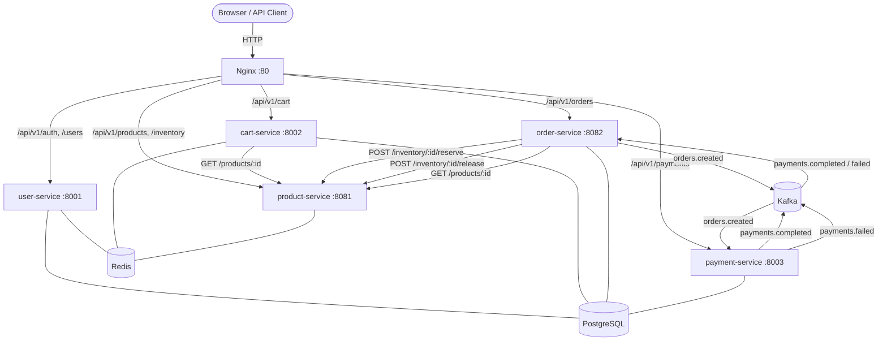
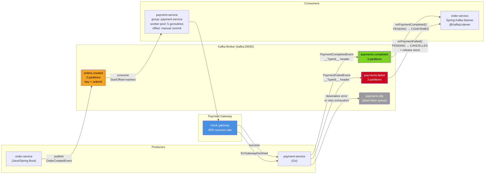
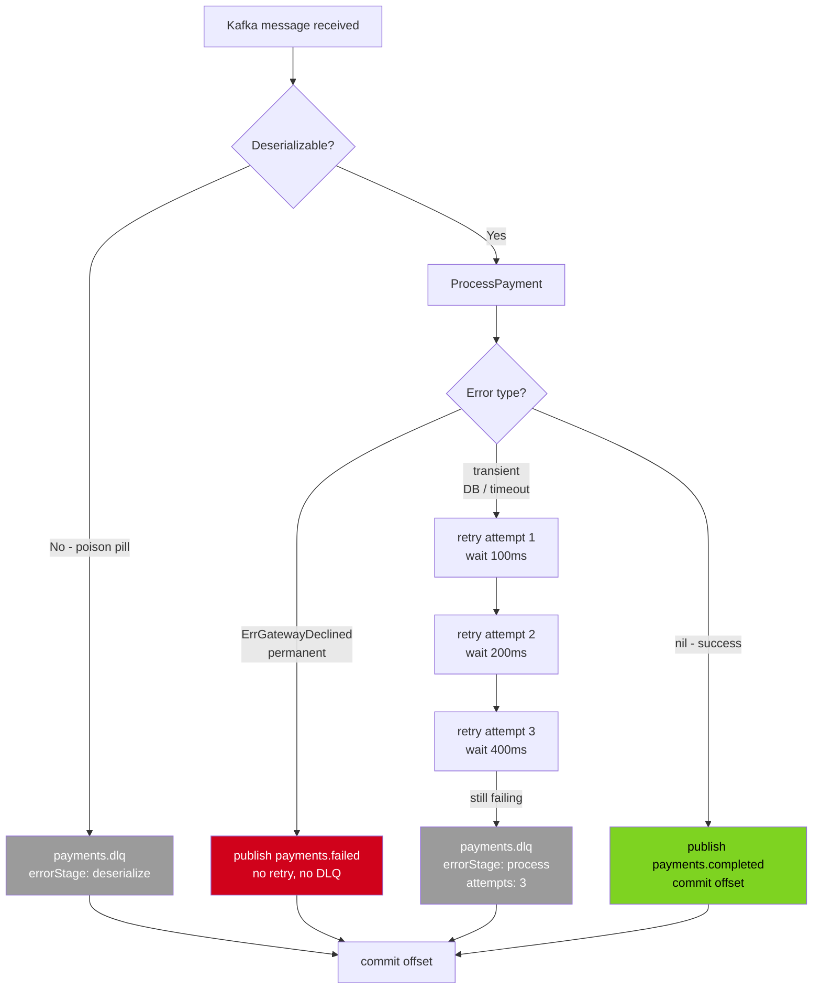
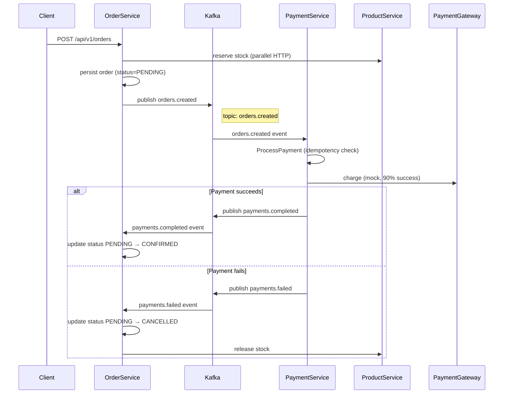
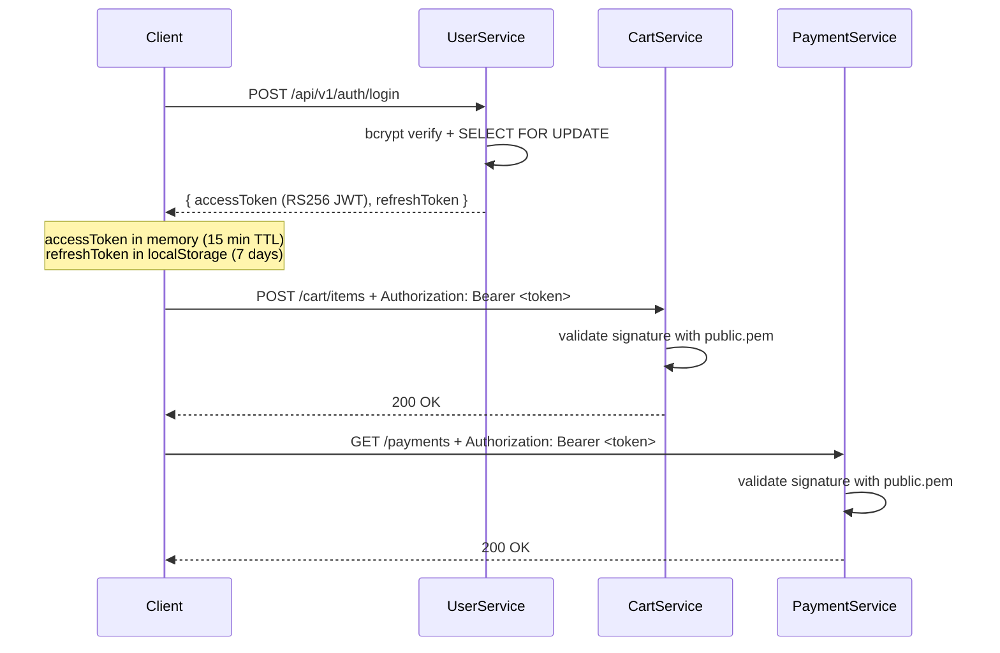
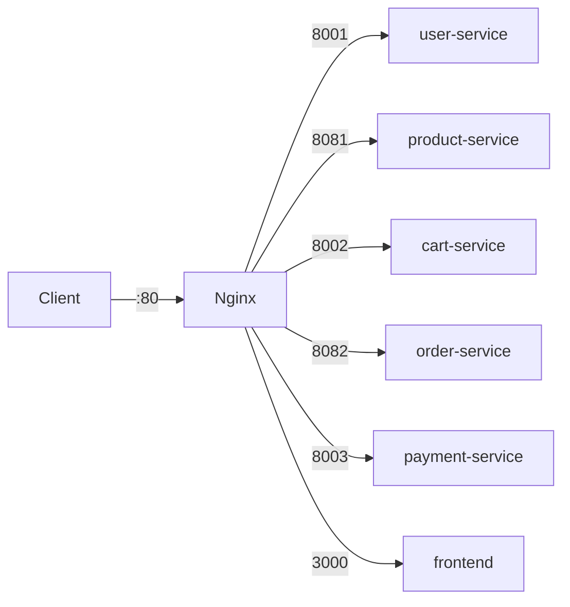

# Service Integration & Communication

This document describes how the five microservices of the e-commerce platform interact. Communication falls into three categories: **synchronous HTTP** (request-reply), **asynchronous Kafka** (event-driven saga), and **shared JWT** (distributed auth).

---

## Architecture Overview



---

## 1. Synchronous HTTP Calls

### 1.1 Cart Service → Product Service

**When:** A user adds an item to their cart.

**What cart-service calls:**
```
GET http://product-service:8081/api/v1/products/{productId}
```

**Why:** Validates the product exists and is `ACTIVE`, and captures the current price to store in Redis.

**Response used:**
```json
{ "success": true, "data": { "id": 1, "name": "Widget", "price": 9.99, "status": "ACTIVE" } }
```

**Resilience:** The client retries up to 3 times with exponential backoff (100 ms → 200 ms → 400 ms). A **circuit breaker** (threshold = 5 failures, timeout = 30 s) wraps all calls. When open, `AddItem` returns `503 SERVICE_UNAVAILABLE` immediately — no HTTP is made. `GetCart`, `UpdateItem`, `RemoveItem`, and `ClearCart` bypass the product client entirely (pure Redis paths) and continue working in degraded mode.

`404` responses are not counted as circuit failures.

**Config:** `PRODUCT_SERVICE_URL=http://product-service:8081`

---

### 1.2 Order Service → Product Service

Order creation does three calls to product-service, all using an internal Docker hostname that is **blocked at the Nginx gateway** (returns `403` for external callers).

#### Reserve Stock
```
POST http://product-service:8081/api/v1/inventory/{productId}/reserve
{ "quantity": 2, "referenceId": "order-{userId}" }
```
Called in **parallel** via `CompletableFuture` for every item in the order. If any reservation fails with `409 Conflict` (insufficient stock), all already-reserved items are released and the order is rejected.

#### Release Stock (compensation)
```
POST http://product-service:8081/api/v1/inventory/{productId}/release
{ "quantity": 2, "referenceId": "order-{userId}" }
```
Called during order cancellation or on creation failure. Errors are logged and skipped (non-fatal — the saga handles the rest).

#### Get Product Details
```
GET http://product-service:8081/api/v1/products/{productId}
```
Called after stock is reserved to capture `name` and `price` for the order item record.

**Retry / Circuit breaker:** order-service uses Spring's `@CircuitBreaker` and `@Retry` annotations on `ProductServiceClient`.

**Config:** `PRODUCT_SERVICE_URL=http://product-service:8081`

---

## 2. Asynchronous Kafka (Choreography Saga)

The order-to-payment flow is a choreography saga — no central orchestrator. Each service reacts to events on topics it subscribes to.

### Event-Driven Architecture



### Retry & DLQ Routing



### Saga Sequence



### 2.1 Topic: `orders.created`

| | Detail |
|---|---|
| Producer | order-service (Java) |
| Consumer | payment-service (Go), group `payment-service` |
| Key | `orderId` (ensures ordered delivery per order) |
| Partitions | 3 |

**Event fields:**

```json
{
  "orderId": "uuid",
  "userId": "uuid",
  "totalAmount": 29.97,
  "items": [
    { "productId": 1, "quantity": 2, "unitPrice": 9.99 }
  ]
}
```

**Consumer details (payment-service):**
- Worker pool: 5 goroutines (`KAFKA_WORKER_COUNT`)
- Buffered channel size: 100
- Manual offset commit — committed only after processing
- `StartOffset=earliest` — no events are skipped on restart

### 2.2 Topic: `payments.completed`

| | Detail |
|---|---|
| Producer | payment-service (Go) |
| Consumer | order-service (Java), Spring Kafka |
| Partitions | 3 |

**Event fields:**

```json
{
  "orderId": "uuid",
  "paymentId": "uuid",
  "amount": 29.97
}
```

The Go producer sets the `__TypeId__` Kafka header to `com.ecommerce.order_service.kafka.event.PaymentCompletedEvent` so Spring's `JsonDeserializer` resolves the correct class without extra configuration on the Java side.

Order-service listener: `PaymentEventConsumer.onPaymentCompleted()` — transitions order `PENDING → CONFIRMED`.

### 2.3 Topic: `payments.failed`

| | Detail |
|---|---|
| Producer | payment-service (Go) |
| Consumer | order-service (Java) |
| Partitions | 3 |

**Event fields:**

```json
{
  "orderId": "uuid",
  "reason": "gateway declined (paymentId=...)"
}
```

Order-service listener: `PaymentEventConsumer.onPaymentFailed()` — transitions order `PENDING → CANCELLED`, then releases reserved stock via `POST /inventory/:id/release`.

### 2.4 Topic: `payments.dlq` (Dead Letter Queue)

Payment-service routes two failure classes here:

| Failure class | Behaviour |
|---|---|
| Deserialization error (poison pill) | Sent to DLQ immediately, offset committed |
| Retry exhaustion (3× with backoff) | Sent to DLQ after 100 ms / 200 ms / 400 ms |
| Gateway declined (`ErrGatewayDeclined`) | `payments.failed` published, **no DLQ** |

**DLQ message fields:** `originalTopic`, `originalPartition`, `originalOffset`, `originalKey`, `originalValue` (base64), `errorReason`, `errorStage`, `attempts`, `failedAt`, `correlationId`.

### 2.5 Idempotency

Payment-service uses `orderId` as the idempotency key. A `UNIQUE` constraint on the payments table ensures that even if `orders.created` is delivered twice, only one payment row is created. The second delivery is a no-op.

---

## 3. Authentication & JWT Distribution

All user-facing services validate JWT tokens issued by user-service. No service issues its own tokens.



**Token details:**

| Field | Value |
|---|---|
| Algorithm | RS256 (asymmetric) |
| Access token TTL | 15 minutes |
| Refresh token TTL | 7 days |
| Claims | `userID`, `email`, `role`, `jti`, `exp` |

**Public key distribution:** The file `./user-service/keys/public.pem` is mounted read-only at `/app/keys/public.pem` into cart-service and payment-service via Docker volume. Each service loads the key at startup.

**Services that validate JWT:**
- `cart-service` — all `/api/v1/cart` routes (extracts `userID` for Redis key)
- `payment-service` — all `/api/v1/payments` routes (identifies the paying user)
- `order-service` — all `/api/v1/orders` routes (via Spring Security)

**Services that do not validate JWT:**
- `product-service` — public catalog; seller operations use the `X-Seller-Id` header instead
- `user-service` — issues tokens, not a consumer

**Logout:** The access token JTI is blacklisted in Redis (TTL = remaining token lifetime). All refresh tokens for the user are revoked in the DB. Subsequent requests with the old token fail at the blacklist check before signature verification.

---

## 4. Nginx Gateway

Nginx is the single entry point on port `80`. All inter-service HTTP happens on the internal Docker network; services are not directly exposed in production.



### Route Table

| Path pattern | Target | Notes |
|---|---|---|
| `/api/v1/auth/*` | user-service | Extra rate limit: 5 req/min (brute-force) |
| `/api/v1/users/*` | user-service | |
| `/api/v1/products*` | product-service | |
| `/api/v1/inventory/*/reserve` | **403 Blocked** | Service-to-service only |
| `/api/v1/inventory/*/release` | **403 Blocked** | Service-to-service only |
| `/api/v1/inventory*` | product-service | Stock queries allowed |
| `/api/v1/categories*` | product-service | |
| `/api/v1/cart*` | cart-service | |
| `/api/v1/orders/*/ship` | **403 Blocked** | Call order-service:8082 directly |
| `/api/v1/orders/*/deliver` | **403 Blocked** | Call order-service:8082 directly |
| `/api/v1/orders*` | order-service | |
| `/api/v1/payments*` | payment-service | |
| `/health/*` | payment-service | Postgres + Kafka readiness |
| `/` (catch-all) | frontend | SPA |

### Rate Limiting

| Zone | Limit | Applied to |
|---|---|---|
| `api_limit` | 10 req/s (burst 5) | All API routes |
| `auth_limit` | 5 req/min (burst 3) | `/api/v1/auth/*` additionally |

### Headers

**Forwarded to upstreams:** `X-Real-IP`, `X-Forwarded-For`, `Host`, `X-Correlation-ID`.

If the client does not send `X-Correlation-ID`, Nginx generates one from `$request_id` and forwards it. Services propagate this ID in logs, outbound HTTP calls (`X-Correlation-ID` header), and Kafka message headers.

**Added to all responses:** `X-Content-Type-Options: nosniff`, `X-Frame-Options: DENY`, `X-XSS-Protection: 1; mode=block`, `Referrer-Policy: no-referrer`, `Content-Security-Policy: default-src 'none'; frame-ancestors 'none'`.

**CORS:** `Access-Control-Allow-Origin: http://localhost:3001` (React dev server / production frontend).

---

## 5. Correlation ID Propagation

Every request gets a `X-Correlation-ID` that flows through the entire call chain for distributed tracing.

```
Client request
    → Nginx (generates if missing, using $request_id)
        → Service A (reads from header, stores in context)
            → Service B (HTTP) — forwards as X-Correlation-ID header
            → Kafka message — written as message header
                → Service C (consumer reads from Kafka header, logs)
```

**Go services:** stored in `context.Context` via `middleware.CorrelationKey`. Outbound HTTP clients and Kafka producers read from context and set the header.

**Java services:** stored in SLF4J `MDC` (`correlationId` key) — automatically included in structured log output.

---

## 6. Infrastructure & Networking

**Docker network:** all services share the `backend` bridge network and resolve each other by service name.

**Internal hostnames used in service-to-service calls:**

| Connection | Address |
|---|---|
| → Postgres | `postgres:5432` |
| → Redis | `redis:6379` |
| → Kafka | `kafka:29092` (internal listener) |
| → product-service | `http://product-service:8081` |
| → order-service | `http://order-service:8082` |

**Volume shared across services:**
- `./user-service/keys:/app/keys:ro` — mounted into user-service, cart-service, payment-service for JWT key access.

**Startup order:**
1. `postgres`, `redis`
2. `zookeeper` → `kafka`
3. `user-service`, `product-service`
4. `cart-service`, `order-service`, `payment-service`
5. `frontend`
6. `nginx`

---

## 7. Complete Interaction Matrix

| From | To | Protocol | Endpoint / Topic | Trigger |
|---|---|---|---|---|
| cart-service | product-service | HTTP GET | `/api/v1/products/{id}` | Add item to cart |
| order-service | product-service | HTTP POST | `/api/v1/inventory/{id}/reserve` | Order created |
| order-service | product-service | HTTP POST | `/api/v1/inventory/{id}/release` | Order cancelled / creation failed |
| order-service | product-service | HTTP GET | `/api/v1/products/{id}` | Capture price at order time |
| order-service | Kafka | Publish | `orders.created` | Order persisted (status=PENDING) |
| payment-service | Kafka | Consume | `orders.created` | Trigger payment processing |
| payment-service | Kafka | Publish | `payments.completed` | Payment gateway succeeded |
| payment-service | Kafka | Publish | `payments.failed` | Gateway declined or saga failure |
| payment-service | Kafka | Publish | `payments.dlq` | Poison pill or retry exhaustion |
| order-service | Kafka | Consume | `payments.completed` | Confirm order |
| order-service | Kafka | Consume | `payments.failed` | Cancel order + release stock |
| user-service | cart-service | JWT (RS256) | — | Token issued at login, validated per request |
| user-service | payment-service | JWT (RS256) | — | Token issued at login, validated per request |
| user-service | order-service | JWT (RS256) | — | Token issued at login, validated per request |
| Nginx | all services | HTTP proxy | See route table | All external client traffic |
